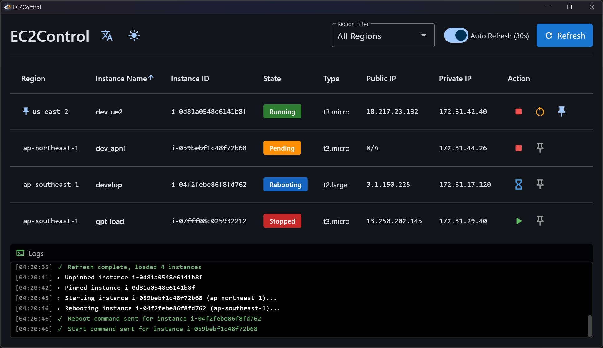

<div align="center">

# EC2Control


一个便捷的 EC2 实例启停小工具

[English](./README_EN.md) | **简体中文**




</div>

## 功能特性

- 查看所有 AWS 区域的 EC2 实例
- 一键启动、停止、重启实例
- 支持按区域筛选
- 实例置顶功能
- 深色/浅色主题切换
- 中英文界面切换


## 使用教程

### 1. 下载应用

前往 [Releases](https://github.com/1zero224/EC2Control/releases) 页面下载最新版本的 `EC2Manager.exe` 文件

### 2. 安装 AWS CLI

访问 [AWS CLI 官方安装指南](https://docs.aws.amazon.com/cli/latest/userguide/getting-started-install.html) 并按照说明安装

**验证安装：**
```bash
aws --version
```

### 3. 创建 IAM 用户并配置权限

1. 登录 [AWS IAM 控制台](https://console.aws.amazon.com/iam/)
3. 在策略面板点击"创建策略"，在弹出的页面中选择"策略编辑器-JSON"，将以下策略粘贴到策略编辑器中，创建策略：

```json
{
    "Version": "2012-10-17",
    "Statement": [
        {
            "Sid": "EC2ReadPermissions",
            "Effect": "Allow",
            "Action": [
                "ec2:DescribeInstances",
                "ec2:DescribeInstanceStatus",
                "ec2:DescribeRegions",
                "ec2:DescribeTags",
                "ec2:GetConsoleScreenshot",
                "ec2:GetConsoleOutput"
            ],
            "Resource": "*"
        },
        {
            "Sid": "EC2WritePermissions",
            "Effect": "Allow",
            "Action": [
                "ec2:StartInstances",
                "ec2:StopInstances",
                "ec2:RebootInstances"
            ],
            "Resource": "*"
        }
    ]
}
```

4. 在用户面板点击"创建用户"，然后在"设置权限"页点击"直接附加策略"，搜索上一步中创建的策略并选中
5. 在用户详情页面点击"安全凭证"，创建访问密钥，选择"命令行界面 (CLI)"用例，得到并保存 Access Key ID 和 Secret Access Key

### 4. 配置 AWS 凭证

使用 `aws configure` 命令配置凭证：

```bash
aws configure
```

按提示输入：

```
AWS Access Key ID [None]: 你的 Access Key ID
AWS Secret Access Key [None]: 你的 Secret Access Key
Default region name [None]: 默认区域（例如：us-east-1，填入你最常用的区域）
Default output format [None]: json
```

### 5. 启动应用

双击 `EC2Manager.exe` 即可使用


## 开发指南

### 安装依赖

```bash
pip install -r requirements.txt
```

### 运行应用

```bash
python main.py
```

### 打包应用

```bash
flet pack main.py --name "EC2Control" --icon "assets/icon.ico" --product-name "EC2Control"
```

打包完成后，可执行文件将生成在 `dist` 目录中。

> **代码质量：** 项目使用 Ruff、Black 和 isort 进行代码检查，配置见 `pyproject.toml`。CI 会自动运行检查。

### 项目结构

```
aws_ec2_gui/
│
├── .github/                     # GitHub 配置
│   └── workflows/               # GitHub Actions 工作流
│       ├── build.yml            # 构建和代码质量检查
│       └── release.yml          # 自动发布
│
├── assets/                      # 静态资源
│   ├── logo.png                 # Logo
│   └── icon.ico                 # 图标
│
├── src/                         # 源代码
│   ├── config/                  # 配置模块
│   │   ├── __init__.py
│   │   ├── constants.py         # 常量定义
│   │   └── settings.py          # 设置管理
│   │
│   ├── core/                    # 核心业务逻辑
│   │   ├── __init__.py
│   │   ├── ec2_service.py       # EC2 服务封装
│   │   └── cache_manager.py     # 缓存管理
│   │
│   ├── ui/                      # 用户界面
│   │   ├── __init__.py
│   │   ├── app.py               # 主应用界面
│   │   ├── components/          # UI 组件
│   │   │   ├── __init__.py
│   │   │   ├── toolbar.py       # 工具栏
│   │   │   ├── instance_table.py # 实例表格
│   │   │   └── console.py       # 控制台输出
│   │   └── themes/              # 主题系统
│   │       ├── __init__.py
│   │       ├── i18n.py          # 国际化
│   │       └── font_scale.py    # 字体缩放
│   │
│   ├── utils/                   # 工具函数
│   │   ├── __init__.py
│   │   └── screen_utils.py      # 屏幕工具
│   │
│   └── main.py                  # 应用入口
│
├── main.py                      # 启动脚本
├── requirements.txt             # 项目依赖
├── pyproject.toml               # 代码质量配置
├── README.md                    # 中文文档
└── README_EN.md                 # 英文文档
```


## 贡献

欢迎提交 Issue 报告和 Pull Request —— 我们感谢所有形式的贡献。


## 许可证

本项目采用 [MIT License](LICENSE) 开源。
